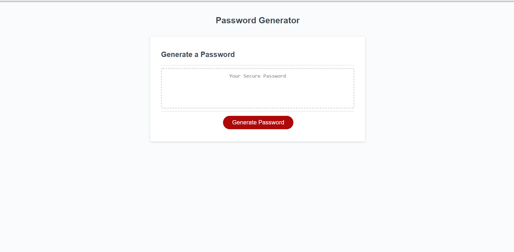

# passwordGenerators
Recreating repo due to a conflict

Within this code i created a website that generates a password with what the user would like. They can pick from having upper case lower case numbers and also characters within their password. They also get to pick the length.

SS: 

Link to deployed website: https://yilmazv.github.io/passwordGenerators/
